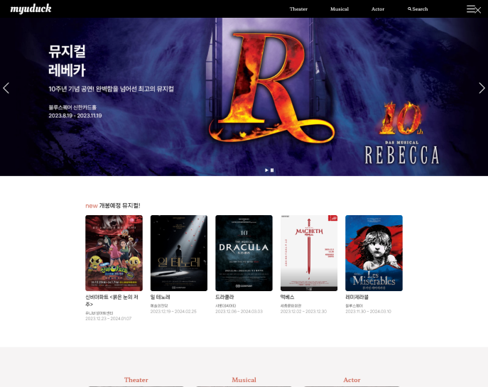

# MYUDUCK 
뮤지컬 관련하여 리뷰 및 정보를 공유하는 사이트를 만들었습니다. 
팀원으로는 강서현, 정해연, 이지영 으로 구성되어 있습니다. 

## 사이트 바로가기
사이트 바로가기 : [MYUDUCK](http://ljy16.dothome.co.kr/myuduck/main/main.php)

## 사용 스택
- Front-end :     
- Back-end : 
- Databse : 

## 프로젝트 소개

저희 사이트는 뮤지컬에 대한 리뷰와 정보를 공유하는 플랫폼으로, 뮤지컬 팬들이 다양한 작품과 배우에 대한 소식을 즐기고 공유할 수 있는 공간입니다. 주요 기능으로는 검색과 찜 기능이 제공되어 사용자들이 원하는 콘텐츠를 쉽게 찾아볼 수 있습니다.

검색 기능을 통해 사용자는 원하는 뮤지컬이나 배우를 빠르게 찾을 수 있습니다. 전체적인 검색 또는 특정 카테고리 선택을 통해 선호하는 내용을 쉽게 발견할 수 있는 검색페이지가 제공됩니다.

또한, 찜 기능을 통해 사용자들은 마이페이지에서 자신이 좋아하는 뮤지컬이나 배우를 관리할 수 있습니다. 두 페이지에 따로 위치한 찜 목록을 통해 사용자는 간편하게 찜한 내용들을 확인할 수 있으며, 마이페이지에서는 찜한 항목을 클릭하면 해당 배우나 뮤지컬의 상세페이지로 이동할 수 있습니다.

## 주요 기능

### 회원 가입

이용약관 동의를 받으며, JavaScript를 활용하여 동의 여부를 체크하고 가입 버튼을 통해 회원 정보 입력 페이지로 이동합니다. 회원 정보 입력 페이지는 아이디와 이메일 중복검사, 주소 검색 등 다양한 기능을 제공합니다. Jquery를 활용하여 유효성 검사와 중복 확인을 수행하며, Daum 우편번호 API를 이용하여 주소를 편리하게 검색할 수 있습니다.

### 게시판

게시판 목록 페이지는 게시글 나열과 검색, 페이징을 포함한 웹 페이지로, 데이터베이스 연결과 세션 관리 초기화 후 게시판 테이블 내용을 변수에 저장하여 글 수를 계산하고, 제목, 작성자, 날짜, 조회수 등의 정보는 데이터베이스의 게시판 및 회원 테이블을 결합하여 동적으로 출력하며, 검색은 GET으로 페이지 정보를 가져와 SQL 인젝션 방지를 위해 처리됩니다. 게시판 작성 페이지는 HTML 폼을 통해 "QAWriteSave.php"로 데이터 전송하며, 게시판 상세 페이지에서는 로그인 상태와 글 번호를 고려하여 조회하고 댓글 관리 및 Ajax를 활용한 비동기 통신이 구현되어 있습니다. 종합적으로 효과적인 게시판 조회, 관리, 댓글 기능을 제공하고 있습니다.

### 찜기능

찜하기 동작을 처리하며, 클라이언트에서 전송된 데이터를 확인하고 로그인 상태를 검사한 후 찜하기 또는 찜 취소 동작을 수행합니다. 데이터베이스에 이미 해당 조건의 레코드가 있는지 확인하고, 그에 따라 레코드를 추가하거나 업데이트한 후 결과를 JSON으로 응답합니다.
사용자의 초기 찜 상태를 확인할 수 있습니다. 클라이언트의 POST 요청을 처리하고 사용자의 로그인 상태를 확인한 후 해당 배우에 대한 찜 상태를 데이터베이스에서 조회하여 JSON 형식으로 반환합니다. 초기 찜 상태가 존재할 경우 해당 정보를 전달합니다.

### 지도 API를 이용한 극장 위치 제공

공연장 정보를 데이터베이스에서 가져와 동적으로 웹 페이지에 출력힙니다. 각 공연장의 로고, 이름, 주소, 최근 주요 작품 등의 정보를 포함한 목록이 표시되며, 지도는 Kakao Maps API를 사용하여 표현하였습니다. 반복문을 활용하여 공연장 정보를 동적으로 출력하고, 클릭 시 해당 공연장의 상세 페이지로 이동하는 기능이 구현하였습니다.

### 검색

사용자가 입력한 검색어와 옵션에 따라 뮤지컬, 배우, 극장의 정보를 동적으로 검색하여 웹 페이지에 결과를 출력하도록 구현하였습니다. 색 입력 폼과 카테고리 링크를 보여주고, 사용자 입력에 따라 실제 검색 결과를 동적으로 생성합니다. 결과는 뮤지컬, 배우, 극장에 대한 이미지와 링크로 구성되며, 해당 항목을 클릭하면 상세 정보 페이지로 이동합니다. 또한, 검색 결과가 없을 경우 "검색 결과가 없습니다." 메시지와 함께 관련 이미지가 표시됩니다. 코드는 jQuery와 Lenis 라이브러리를 사용하였습니다.

<!-- ## 주요 페이지
### 메인 페이지
데이터베이스에서 뮤지컬 정보, QA 게시물, 그리고 공지사항을 가져오기 위해 각각의 테이블에 대한 SQL 쿼리를 실행합니다. 결과는 각각의 배열인 $musicalMainInfo, $QAInfo, $noticeInfo에 저장됩니다. 이 정보들은 메인 화면에 다양한 섹션에서 활용되어 사용자에게 다양한 콘텐츠를 제공합니다.

슬라이더를 위한 Swiper 라이브러리와 부드러운 스크롤 효과를 위한 Lenis가 도입되어 웹 페이지에 풍부한 시각적 효과를 더하고 있습니다. 또한, 메인 화면에는 최신 뮤지컬 소개, 개봉 예정 뮤지컬 목록, 각 카테고리로 이동하는 링크, 최근 QA 게시물, 최근 공지사항 게시물, 티켓 예약 사이트로 이동하는 링크 등 다양한 섹션이 구성되어 사용자에게 풍부한 정보와 편리한 이용 경험을 제공합니다.
### 회원 페이지
- 회원가입 페이지
    - 회원가입 약관 페이지  
    HTML 및 PHP 코드는 사용자에게 이용약관 동의를 받는 페이지입니다. 페이지 상단에는 MYUDUCK 서비스의 기본적인 스타일 및 타이틀이 정의되어 있습니다. 이용약관에 동의하기 위한 체크박스 및 관련 내용들이 섹션으로 구성되어 있습니다. "가입하기" 버튼을 통해 동의 여부를 확인할 수 있습니다.   
    이용약관 동의 여부를 확인하기 위하여 JavaScript를 이용하여 동의 여부를 확인한 경우에 회원 정보 입력 페이지로 이동하도록하였습니다.전체 동의 체크 박스를 클릭하였을 경우에는 agreeCheck1 체크박스의 변경 이벤트를 감지하여, 해당 체크박스가 체크되면 나머지 체크박스들도 모두 체크되도록 처리되도록 하였고, 체크 박스들을 개별로 눌렀을 경우에는 agreeCheck2, agreeCheck3, agreeCheck4 중 하나라도 체크가 해제되면 agreeCheck1도 자동으로 체크 해제되도록 하였습니다. 
    가입 버튼 클릭 시에는 agreeCheck1가 체크가 되었거나 agreeCheck2, agreeCheck3, agreeCheck4가 모두 체크가 되어 있을 경우에만 회원 정보 입력 페이지롤 넘어가게 하였습니다. 
     
    
  - 회원정보 입력 페이지  
    아이디, 비밀번호, 이름, 주소, 이메일, 연락처 등 다양한 필드를 가진 회원가입 양식으록 구성되어 있으며 아이디, 이메일 중복검사 기능과 Daum 우편번호 API를 사용하여 주소를 검색하는 기능을 제공하고 있습니다. 
    아이디 및 이메일 유효성 검사를 하기 위하여 Jquery를 이용하여 idChecking()와 emailChecking() 함수를 사용하여 아이디와 이메일이 유효성 검사와 중복 여부를 서버에서 확인하는 Ajax 요청을 수행하였습니다.  
    아이디와 이메일의 유효성 검사와 중복 검사 여부를 기반으로 하여 비밀번호, 이름, 휴대폰 번호, 우편번호 등을 joinChecks() 함수를 사용하여 입력 필드의 유효성을 검사하였습니다.  
    Daum 우편번호 API를 사용하여 우편번호를 검색하였습니다. searchBtnClick() 함수가 호출되면 Daum 우편번호 서비스 창이 열려 사용자가 선택한 주소가 입력 필드를 채우는 형식으로 하였습니다.  
    
  - 로그인 페이지  
    로그인 페이지는 아이디와 비밀번호를 입력받는 양식과 로그인 버튼이 구성되어 있습니다. 또한, 로그인 상태를 유지할지 선택할 수 있는 체크박스와 함께 회원가입, 아이디 찾기, 비밀번호 찾기에 대한 링크도 제공되어 있습니다. 사용자가 아이디와 비밀번호를 입력하고 로그인 버튼을 클릭하면, 입력된 정보를 데이터베이스에서 확인하여 로그인 여부를 결정하고, 성공 시 세션에 사용자 정보를 저장한 후 메인 페이지로 이동합니다. 
    JavaScript를 사용하여 로그인 버튼(#loginBtn)에 클릭하면 이벤트가 발생하여 사용자가 입력한 아이디(#youId)와 비밀번호(#youPass)를 가져와서 두 값이 모두 비어있는지 확인해주고 비어있지 않으면 데이터베이스를 연결하여 입력한 값이 데이터베이스 안에 들어있는 값과 비교하는 PHP로 넘겨주어 로그인 여부를 확인하고 성공 시 세션에 사용자 정보를 저장한 후 메인 페이지로 이동합니다. 
  - 로그아웃 페이지 
    로그아웃을 누르면 세션에 저장되어 있던 사용자의 정보를 전부 지워지게 만든 후 메인 페이지로 이동하게 하였습니다. 
### 게시판
- 후기 게시판
    - 후기 목록 페이지 
        게시글 목록을 표시하고, 검색 기능, 페이징 기능이 구현하였습니다. 
        connect.php와 session.php 파일을 인크루드하여 데이터베이스 연결과 세션 관리를 초기화한 후 데이터베이스 안에 있는 후기관련 테이블의 내용을 변수에 저장하여 글의 총 갯수를 구하였습니다. 
        제목과 작성자, 작성 날짜, 조회수 등의 정보를 데이터베이스 안에 있는 후기 테이블과 회원 테이블을 합쳐 불러온 뒤 if문과 for문을 사용하여 게시글 수만큼 반복하여 뿌려주었습니다. 
        전체적인 검색 또는 특정 카테고리르 선택하여 검색할 수 있는 기능도 구현하였습니다. GET을 사용하여 페이지 정보를 가져 온 후 검색어와 검색옵션의 공백을 제거하여 SQL 인젝션 방지를 위해 real_escape_string을 사용하여 처리하였습니다. 데이터베이스에서 게시글 정보를 불러 올 때 'WHERE' 절을 추가하여 제목, 내용, 등록자로 검색할 수 있는 쿼리문을 동적으로 생성하여 검색 결과값을 반영하여 출력하였습니다.  
    - 후기 작성 페이지 
        index.php 파일에는 리뷰 또는 질문을 작성할 수 있는 HTML 폼이 포함되어 있습니다.
        폼에는 제목, 내용 및 제출 버튼이 있습니다.
        폼의 action 속성은 "QAWriteSave.php"로 설정되어 있어, 폼 데이터가 "QAWriteSave.php"라는 PHP 스크립트에서 처리될 것으로 표시됩니다.
        폼 제출을 처리하는 PHP 스크립트 (QAWriteSave.php):

        이 스크립트는 데이터베이스 연결 및 세션 관리와 같은 필수 파일을 포함하여 시작됩니다.
        폼을 통해 전송된 데이터 (boardTitle 및 boardContents)를 검색합니다.
        사용자가 로그인했는지 확인하기 위해 세션 변수 ('youId')의 존재를 확인합니다.
        사용자가 로그인하지 않은 경우 경고를 표시하고 이전 페이지로 리디렉션합니다.
        사용자가 로그인한 경우 제목과 내용이 모두 제공되었는지 확인합니다. 제공되지 않았다면 경고를 표시하고 이전 페이지로 리디렉션합니다.
        제목과 내용이 모두 제공된 경우 데이터를 데이터베이스에 추가합니다.
    - 후기 상세 페이지 
     사용자의 로그인 상태, 글 번호 등을 고려하여 게시글 내용을 조회하고, 이전/다음 글을 가져오는 기능과 댓글을 관리하는 기능이 구현되어 있습니다.
      세션 및 변수 설정:
      사용자의 로그인 상태에 따라 세션에서 아이디와 비밀번호를 가져옵니다.
      URL에서 글 번호(boardID)를 가져옵니다.
      이전/다음 글 가져오기:
      현재 글의 번호를 기반으로 이전 글과 다음 글을 조회합니다.
      조회된 정보는 해당 글의 이전과 다음 글로 연결되어 이전글/다음글로 이동할 수 있도록 합니다.
      게시글 조회 및 출력:
      주어진 글 번호를 기반으로 해당 글의 정보를 데이터베이스에서 가져와 출력합니다.
      글 조회 수(boardView)를 1 증가시킵니다.
      관리자 및 글 작성자에 따른 버튼 출력:
      현재 로그인한 사용자가 글 작성자이거나 관리자인 경우 수정 및 삭제 버튼을 출력합니다.
      댓글 출력 및 관리:
      해당 글에 대한 댓글을 데이터베이스에서 가져와 출력합니다.
      댓글 작성, 수정, 삭제를 위한 팝업 창과 기능을 구현합니다.
      댓글 작성은 로그인 상태를 확인하고, 작성된 댓글은 새로고침 없이 동적으로 추가됩니다.
      JavaScript 및 jQuery 활용:
      사용자 경험을 향상시키기 위해 JavaScript와 jQuery를 활용합니다.
      댓글의 얼굴 표정은 랜덤으로 지정되어 다양한 이미지가 적용됩니다.
      Ajax를 사용하여 댓글의 작성, 수정, 삭제와 관련된 서버와의 비동기 통신을 처리합니다.
      총평으로 이 코드는 후기 게시판에서 글을 조회하고 관리하는 기능을 제공하며, 댓글 관리 등 사용자 상호작용에도 신경쓰인 웹 페이지입니다.
- 공지사항 게시판
    - 공지사항 목록 페이지 
        게시글 목록을 표시하고, 검색 기능, 페이징 기능이 구현하였습니다. 
        connect.php와 session.php 파일을 인크루드하여 데이터베이스 연결과 세션 관리를 초기화한 후 데이터베이스 안에 있는 후기관련 테이블의 내용을 변수에 저장하여 글의 총 갯수를 구하였습니다. 
        제목과 작성자, 작성 날짜, 조회수 등의 정보를 데이터베이스 안에 있는 공지사항 테이블과 회원 테이블을 합쳐 불러온 뒤 if문과 for문을 사용하여 게시글 수만큼 반복하여 뿌려주었습니다. 
        전체적인 검색 또는 특정 카테고리르 선택하여 검색할 수 있는 기능도 구현하였습니다. GET을 사용하여 페이지 정보를 가져 온 후 검색어와 검색옵션의 공백을 제거하여 SQL 인젝션 방지를 위해 real_escape_string을 사용하여 처리하였습니다. 데이터베이스에서 게시글 정보를 불러 올 때 'WHERE' 절을 추가하여 제목, 내용, 등록자로 검색할 수 있는 쿼리문을 동적으로 생성하여 검색 결과값을 반영하여 출력하였습니다.  
    - 공지사항 작성 페이지 
      
    - 공지사항 상세 페이지 
### 검색 페이지 
- 검색 메인 페이지 
- 검색 상세 페이지 
### 뮤지컬
- 뮤지컬 메인 페이지 
- 뮤지컬 상세 페이지 
### 배우
- 배우 메인 페이지 
- 배우 상세 페이지 
### 극장
- 극장 메인 페이지 
- 극장 상세 페이지 
### 마이페이지
- 마이페이지
- 회원 정보 수정 페이지 
- Password 변경 페이지 
- 찜 페이지   -->
